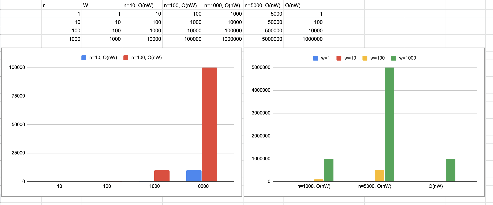

# Määrittelydokumentti

Ohjelman tarkoituksena on luoda halutun pituisia soittolistoja annetusta videolistasta, käyttäen `Knapsack` [1,2] -ongelmaa varten toteutettua algoritmia. Ongelman suomenkielinen termi on `Repunpakkaus` [3]. Ongelma on NP-täydellinen ongelma [1,7], näin se on ollen laskennallisesti vaativa. Toteuttamalleni algoritmille annetaan lista YouTube -videoista sekä halutun soittolistan pituus. Näistä videoista valikoidaan kombinaatio, joista muodostuu halutun pituinen yhdistelmä videoita. Algoritmille voidaan antaa esimerkiksi lista tuhannesta videosta ja näiden pituuksista, sekä haluttu soittolistan pituus. Algoritmi valitsee listalta videot, joista muodostuu soittolista, joka on mahdollisimman lähellä annettua pituutta, mutta ei kuitenkaan ylitä annettua pituutta.

Knapsack -ongelmassa on siis ajatuksena, että käytössä on tila, johon mahtuu vain rajallinen määrä asioita ja tähän tilaan tulisi tietyin kriteerein valita mahdollisimman arvokkaita/laadukkaita asioita niin, että tilan arvo maksimoituu ja annettu tilan koko ei ylity. Tilaan laitettavilla asioilla on tietty arvo, esimerkiksi paino tai pituus, tässä harjoitustyössä musiikin pituus sekä käyttäjien antamat arvosanat, 1-5 tähteä, jonka perusteella tilaan sijoitetaan asioita.

Tässä harjoitustyössä tietorakenteina käytetään jonoa, mapia ja arraylistia.
Algoritmi saa kaksi arvoa; halutun soittolistan pituuden sekä jonon, jonka jokainen alkio on map muodossa oleva tietorakenne. Tämä rakenne sisältää avain/arvo -pareina videon osoitteen, otsikon sekä pituuden. Tästä tiedosta pituus on algoritmin kannalta tärkein.
Algoritmin palautusarvo on jono, jossa jokainen alkio on myös map muotoinen tietorakenne.
ArrayList tietorakennetta käytetään käyttöliittymässä listoja tarvitsevissa kohdissa.

Algoritmin aika- ja tilavaatimus on `O(nW)`, jossa `n` on annetun soittolistan videoiden lukumäärä, sekä `W` on halutun soittolistan pituus.

Jonon tilavaatimus on `O(n)`. Jonossa lisäys- ja poisto-operaatioiden aikavaatimukset on `O(1)` [4].
Mapin tilavaatimus on `O(n)`. Mapissa lisäysoperaation aikavaatimus on `O(1)`, kun taas poiston aikavaatimus on `O(n)` [5].
ArrayList tilavaatimus on `O(n)`. ArrayListissa lisäysoperaation aikavaatimus on `O(1)` ja poisto-operaation aikavaatimus on `O(n)` [6]. Tässä projektissa toteutetussa ArrayList tietorakenteessa uusi alkio lisätään aina listan loppuun, sekä alkioita poistetaan vain listan alusta.

Ohjelma kehitetään web-sovelluksena, käyttäen React kirjastoa ja Typescript kieltä.

Koska repunpakkaus on NP-täydellinen ongelma, on se laskennallisesti vaativa ongelma. Tästä johtuen tutkin mahdollisuuksia performanssitestien kirjoittamiseen sekä teen graafin joka kuvastaa suoritusajan kasvua syötteen kasvun myötä.

 
*Graafi josta selviää miten `O(nW)` kasvaa erilaisilla `n` ja `W` arvoilla.*

## Lähteet
- [1] https://en.wikipedia.org/wiki/Knapsack_problem Knapsack problem - Ladattu 20.7.2020
- [2] http://www.es.ele.tue.nl/education/5MC10/Solutions/knapsack.pdf Lecture 13: The Knapsack Problem - Ladattu 20.7.2020
- [3] https://www.cs.helsinki.fi/u/ahslaaks/kkkk.pdf Kisakoodarin käsikirja, Antti Laaksonen - Ladattu 21.7.2020
- [4] https://en.wikipedia.org/wiki/Queue_(abstract_data_type) Queue (abstract data type) - Ladattu 20.7.2020
- [5] https://en.wikipedia.org/wiki/Associative_array#Comparison Associative array - Ladattu 24.7.2020
- [6] https://en.wikipedia.org/wiki/Dynamic_array#Performance Dynamic array - Ladattu 3.8.2020
- [7] https://www.cc.gatech.edu/~rpeng/CS3510_F16/notes/Nov28knapsackNPC.pdf NP-Completeness of Knapsack - Ladattu 14.8.2020
