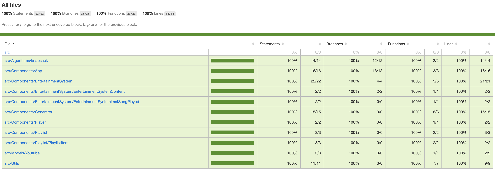
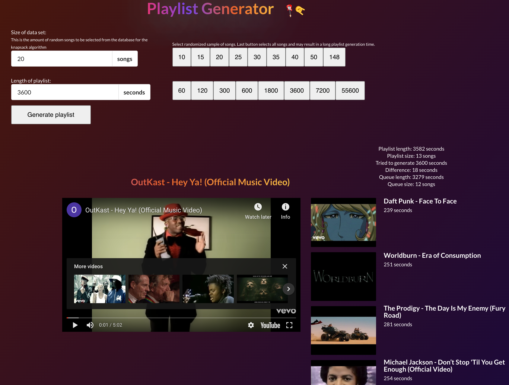
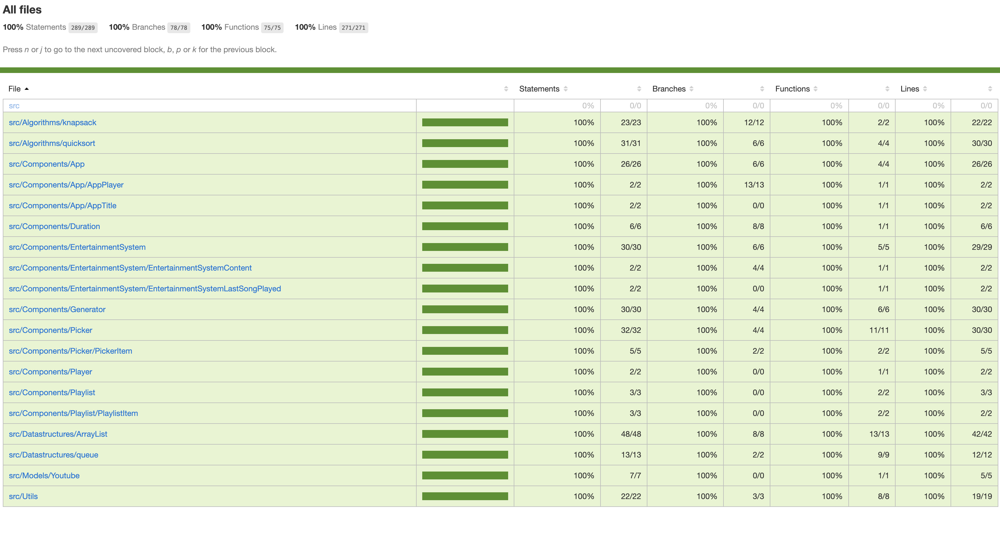
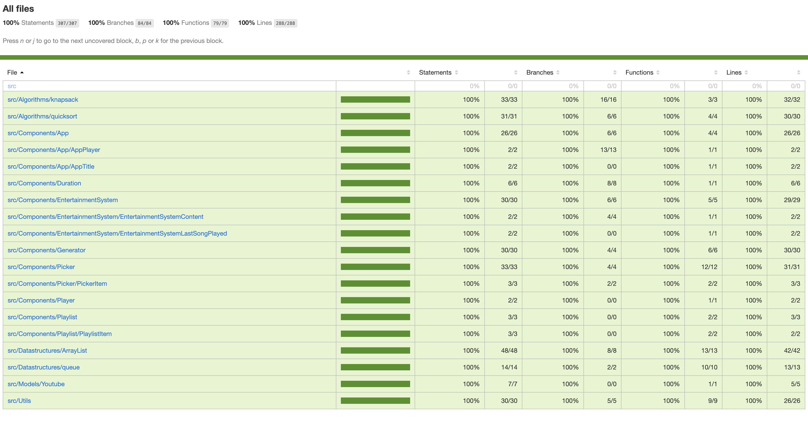
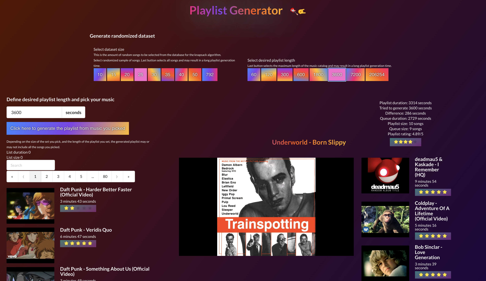

# Testausdokumentti

Mikäli haluat ajaa testit omalla koneella, huomaathan että sinulla pitää olla `node.js` ympäristö sekä `npm` paketinhallintajärjestelmä asennettuna.

Testit on kirjoitettu käyttäen `Jest` kirjastoa. Jest on konfiguroitu suorittamaan testit `/src` hakemistosta löytyville tiedostoille. Testitiedostot on nimetty `.test.ts` tai `.test.tsx` päätteellä. `.ts` pääte indikoi typescriptiä, kun taas `.tsx` pääte indikoi typescriptillä kirjoitettua React komponenttia.

Automaattisesti testit voi ajaa `npm test` komennolla ja testikattavuuden voi generoida komennolla `npm run test-coverage`. Testikattavuusraportti löytyy [coverage](/coverage) hakemistosta. Testikattavuus löytyy myös [Github Pagesista](https://juhq.github.io/knapsack-playlist/coverage/lcov-report/), jonne se generoidaan automaattisesti joka kerta, kun `master` repositorion haara päivittyy Githubissa. Testikattavuuden thresholdiksi, eli rajaksi, on määritelty optimisesti 100%, eli täysi kattavuus. Tämä arvo saattaa muuttua projektin edetessä, sillä 100% testikattavuuden jahtaaminen ei välttämättä ole järkevää.

Automaattisia testejä voi ajaa myös komennolla `npm test -- --verbose` (huomaa `--` välissä, tämä on tärkeä), jolloin jokaisen yksikkotestin suoritus näkyy ruudulla. Saman `--verbose` lipun voi antaa myös `test-coverage` komennolle.

Lisään tähän dokumenttiin projektin edetessä kuvakaappauksia testeistä ja testikattavuuksista. Tämän lisäksi lisään myös kuvankaappauksia käyttöliittymästä.


## Performanssitestaus

Performanssitestausta voi suorittaa komennolla `npm run performance-test`. Tämän komennon output näyttää jotakuinkin seuraavalta.

```bash
Knapsack recursive playlist generation 10 videos, 3600 seconds x 194,943 ops/sec ±1.86% (82 runs sampled)
Knapsack recursive playlist generation 20 videos, 3600 seconds x 1.72 ops/sec ±1.74% (9 runs sampled)
Fastest is Knapsack recursive playlist generation 10 videos, 3600 seconds
```


### Viikko 1





### Viikko 2




### Viikko 3



