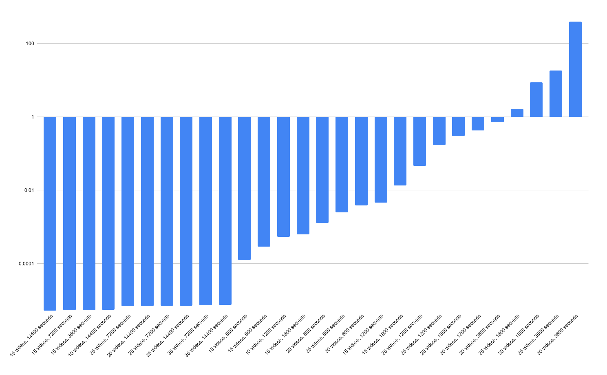
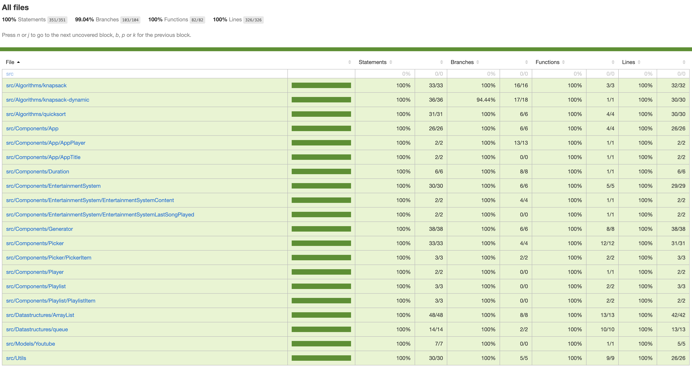
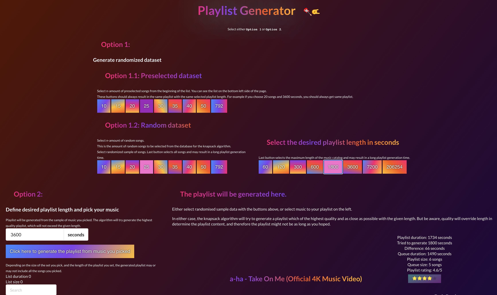

# Testausdokumentti

Mikäli haluat ajaa testit omalla koneella, huomaathan että sinulla pitää olla `node.js` ympäristö sekä `npm` paketinhallintajärjestelmä asennettuna.

Testit on kirjoitettu käyttäen `Jest` kirjastoa. Jest on konfiguroitu suorittamaan testit `/src` hakemistosta löytyville tiedostoille. Testitiedostot on nimetty `.test.ts` tai `.test.tsx` päätteellä. `.ts` pääte indikoi typescriptiä, kun taas `.tsx` pääte indikoi typescriptillä kirjoitettua React komponenttia.

Automaattisesti testit voi ajaa `npm test` komennolla ja testikattavuuden voi generoida komennolla `npm run test-coverage`. Testikattavuusraportti löytyy [coverage](/coverage) hakemistosta. Testikattavuus löytyy myös [Github Pagesista](https://juhq.github.io/knapsack-playlist/coverage/lcov-report/), jonne se generoidaan automaattisesti joka kerta, kun `master` repositorion haara päivittyy Githubissa. Testikattavuuden thresholdiksi, eli rajaksi, on määritelty optimisesti 100%, eli täysi kattavuus. Tämä arvo saattaa muuttua projektin edetessä, sillä 100% testikattavuuden jahtaaminen ei välttämättä ole järkevää.

Automaattisia testejä voi ajaa myös komennolla `npm test -- --verbose` (huomaa `--` välissä, tämä on tärkeä), jolloin jokaisen yksikkotestin suoritus näkyy ruudulla. Saman `--verbose` lipun voi antaa myös `test-coverage` komennolle.

Lisään tähän dokumenttiin projektin edetessä kuvakaappauksia testeistä ja testikattavuuksista. Tämän lisäksi lisään myös kuvankaappauksia käyttöliittymästä.


## Performanssitestaus

Performanssitestausta voi suorittaa komennolla `npm run performance-test`. Tämän komennon output näyttää jotakuinkin seuraavalta.

```bash
Knapsack recursive playlist generation 10 videos, 3600 seconds x 194,943 ops/sec ±1.86% (82 runs sampled)
Knapsack recursive playlist generation 20 videos, 3600 seconds x 1.72 ops/sec ±1.74% (9 runs sampled)
Fastest is Knapsack recursive playlist generation 10 videos, 3600 seconds
```


Ajoin performanssitestit torstaina 20.8.2020 `MacBook Pro (16-inch, 2019)` tietokoneella jonka speksit ovat:

```
Processor 2,6 GHz 6-Core Intel Core i7
Memory 16 GB 2667 MHz DDR4
```

Ajokomentona käytin `time npm run performance-test` komentoa, jolla voin seurata koko suorituksen kestoa. Suorituksen näkyy seuraavan koodiblokin lopussa.

```
> knapsack-playlist@0.1.0 performance-test
> tsc --p tsconfig.algo.json && node benchmark-build/benchmark.js

Knapsack recursive playlist generation 10 videos, 600 seconds x 7,931 ops/sec ±4.53% (81 runs sampled) 0.00012608282436583343
Knapsack recursive playlist generation 10 videos, 1200 seconds x 1,858 ops/sec ±1.33% (87 runs sampled) 0.000538234959768224
Knapsack recursive playlist generation 10 videos, 1800 seconds x 1,589 ops/sec ±1.09% (88 runs sampled) 0.0006291749210534841
Knapsack recursive playlist generation 10 videos, 3600 seconds x 191,344 ops/sec ±0.93% (87 runs sampled) 0.0000052261807431983075
Knapsack recursive playlist generation 10 videos, 7200 seconds x 191,942 ops/sec ±1.15% (89 runs sampled) 0.000005209910175621602
Knapsack recursive playlist generation 10 videos, 14400 seconds x 180,978 ops/sec ±2.32% (84 runs sampled) 0.000005525529266677877
Knapsack recursive playlist generation 15 videos, 600 seconds x 3,396 ops/sec ±0.71% (87 runs sampled) 0.0002944851051949912
Knapsack recursive playlist generation 15 videos, 1200 seconds x 215 ops/sec ±1.67% (81 runs sampled) 0.004654678085016835
Knapsack recursive playlist generation 15 videos, 1800 seconds x 74.49 ops/sec ±1.20% (65 runs sampled) 0.01342417984615385
Knapsack recursive playlist generation 15 videos, 3600 seconds x 184,548 ops/sec ±1.07% (89 runs sampled) 0.000005418634165790351
Knapsack recursive playlist generation 15 videos, 7200 seconds x 185,294 ops/sec ±0.77% (89 runs sampled) 0.000005396838793623576
Knapsack recursive playlist generation 15 videos, 14400 seconds x 189,978 ops/sec ±0.43% (88 runs sampled) 0.000005263778891633418
Knapsack recursive playlist generation 20 videos, 600 seconds x 784 ops/sec ±0.55% (88 runs sampled) 0.001275667104920613
Knapsack recursive playlist generation 20 videos, 1200 seconds x 21.36 ops/sec ±0.85% (38 runs sampled) 0.04682135230263157
Knapsack recursive playlist generation 20 videos, 1800 seconds x 3.34 ops/sec ±7.35% (13 runs sampled) 0.2997128173846154
Knapsack recursive playlist generation 20 videos, 3600 seconds x 1.40 ops/sec ±11.14% (8 runs sampled) 0.7162524971249999
Knapsack recursive playlist generation 20 videos, 7200 seconds x 141,120 ops/sec ±0.57% (84 runs sampled) 0.0000070861663656559464
Knapsack recursive playlist generation 20 videos, 14400 seconds x 142,660 ops/sec ±0.46% (80 runs sampled) 0.0000070096759547161424
Knapsack recursive playlist generation 25 videos, 600 seconds x 400 ops/sec ±1.18% (81 runs sampled) 0.0025000605778866722
Knapsack recursive playlist generation 25 videos, 1200 seconds x 5.87 ops/sec ±6.16% (19 runs sampled) 0.17029015563157895
Knapsack recursive playlist generation 25 videos, 1800 seconds x 0.60 ops/sec ±8.06% (6 runs sampled) 1.6723391601666666
Knapsack recursive playlist generation 25 videos, 3600 seconds x 0.05 ops/sec ±0.64% (5 runs sampled) 18.5307227206
Knapsack recursive playlist generation 25 videos, 7200 seconds x 142,781 ops/sec ±0.55% (90 runs sampled) 0.0000070037101743569314
Knapsack recursive playlist generation 25 videos, 14400 seconds x 138,835 ops/sec ±0.38% (91 runs sampled) 0.0000072027886582366
Knapsack recursive playlist generation 30 videos, 600 seconds x 259 ops/sec ±1.65% (77 runs sampled) 0.00385907188707483
Knapsack recursive playlist generation 30 videos, 1200 seconds x 2.33 ops/sec ±1.88% (10 runs sampled) 0.4290266762
Knapsack recursive playlist generation 30 videos, 1800 seconds x 0.11 ops/sec ±3.64% (5 runs sampled) 8.788676679800002
Knapsack recursive playlist generation 30 videos, 3600 seconds x 0.00 ops/sec ±0.97% (5 runs sampled) 398.08291323199995
Knapsack recursive playlist generation 30 videos, 7200 seconds x 137,326 ops/sec ±0.62% (86 runs sampled) 0.00000728193362230423
Knapsack recursive playlist generation 30 videos, 14400 seconds x 133,196 ops/sec ±0.29% (89 runs sampled) 0.0000075077095137039126

Fastest is Knapsack recursive playlist generation 10 videos, 7200 seconds,Knapsack recursive playlist generation 10 videos, 3600 seconds
npm run performance-test  4426.54s user 24.69s system 99% cpu 1:14:12.28 total
```

<br />
*Graafi josta selviää miten nopeasti toteutettu algoritmi suoriutuu mistäkin datasetistä*

Ylläoleva graafi on piirretty performanssitestien tuloksista. Se on sortattu niin että ensimmäisenä vasemmalta löytyy nopeimmat datasetit ja oikealle mentäessä algoritmin suoritus hidastuu. Nopein datasetti toteuttamalleni algoritmille on 15 videota ja neljän tunnin soittolista. Hitain taasen on 30 videota ja tunnin soittolista.

#### Kuinka tätä voisi jatkokehittää?

Ongelmalle pitäisi ehdottomasti kehittää dynaamista ohjelmointia hyödyntäen versio, joka pitää muistissa generoituja soittolistoja ja valitsee taulukon alaoikealta viimeisen listan. Omien aikataulupaineiden vuoksi en saanut tuota kyseistä versiota valmiiksi käyttämälläni tietorakenteella.

Jatkokehitystä ajatellen tulisi myös tämä hypoteettinen dynaamisella ohjelmoinnilla toteutettu versio performanssitestata samalla datasetillä, ja näitä kahta implementaatiota tulisikin vertailla keskenään.

Mikäli tätä jatkokehitettäisiin tätä kurssia pidemmälle, tulisi tietorakennettakin varmasti parantaa joillain tavoin. En esimerkiksi ole kovinkaan tyytyväinen valitsemaani `seconds` avaimeen listojen alkioissa, kuvaavampi nimi voisi olla esimerkiksi `length` tai `lengthInSeconds`.


### Viikko 1


### Viikko 2


### Viikko 3


### Viikko 5



