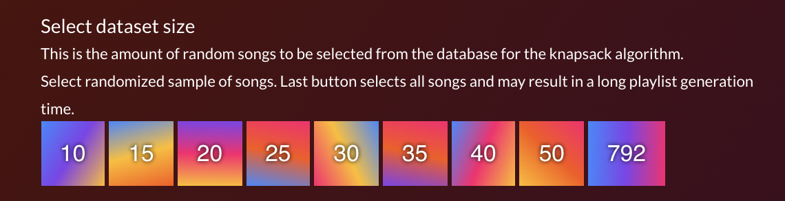
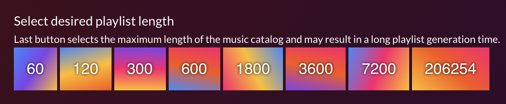
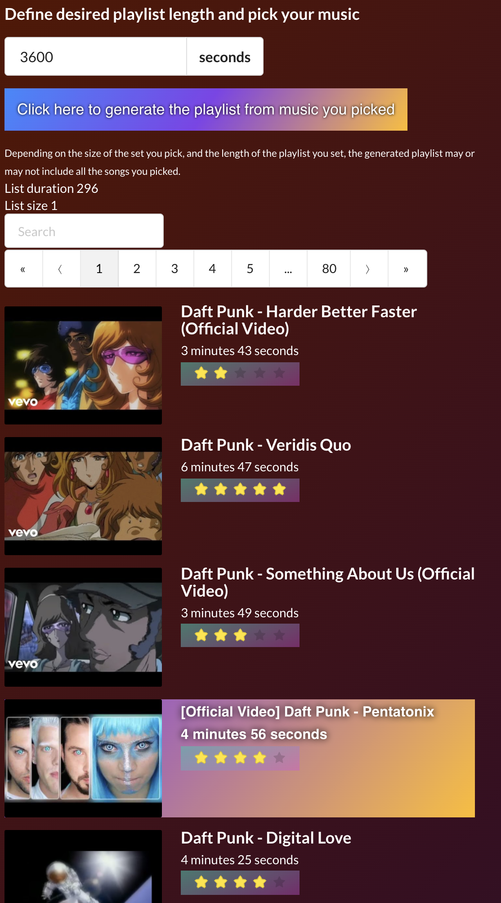
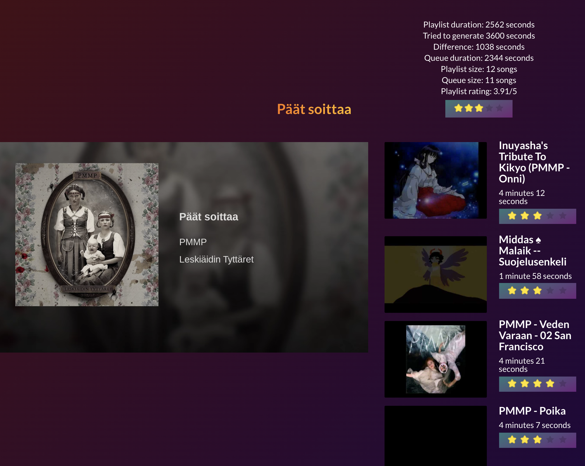

# Käyttöohjeet

Projektin käyttöohjeet

## Sovelluksen käyttöohjeet

Projektin aiheena on musiikkisoittolistan generointi käyttäen `Knapsack` -algoritmia. Toteuttamani algoritmi pyrkii luomaan mahdollisimman laadukkaan soittolistan, joka ei ylitä annettua pituutta. Jokaisella kappaleella on etukäteen satunnaisesti määritelty tähtiarvosana (rating) väliltä 1-5.

Sovelluksessa on kaksi käyttötapaa. Ensimmäisessä tavassa valitaan datasetin koko (datasetti on tässä tapauksessa satunnainen otos videotietokannasta) painamalla Kuvan 1 nappeja. Datasetin lisäksi valitaan halutun soittolistan pituus, painamalla Kuvan 2 nappeja. Kun molemmat valinnat on tehty, lähtee algoritmi automaattisesti käyntiin ja luo soittolistan. Riippuen datasetin koosta sekä halutusta soittolistan pituudesta, algoritmin suoritus saattaa kestää. Omien havaintojeni perusteella `20` kappaletta ja `3600` sekuntia toimii oikein nopsakasti. `30` kappaletta ja `3600` tai `7200` sekuntia saattaa jo kestää useita sekunteja tai kymmeniä sekunteja, riippuen millainen datasetti konepellin alla generoidaan. Soittolista tulee näkyviin näiden nappien alle, ruudun oikeaan kohtaan, kuten Kuva 4 havainnoi. Samalla soittolistan ensimmäinen kappale lähtee automaattisesti soimaan.

<br />
*Kuva 1, satunnaisen datasetin napit*

<br />
*Kuva 2, satunnaisesta datasetistä luotavan soittolistan maksimipituus*


Vaihtoehtoinen tapa on valita vasemmasta reunasta (Kuva 3) halutut kappaleet sekä haluttu soittolistan pituus. Näin voit varmistaa että generoitu soittolista sisältää vain haluamaasi musiikkia. Algoritmin luoma soittolista ei kuitenkaan välttämättä sisällä kaikkia valitsemiasi kappaleita. Kun olet valinnut haluamasi kappaleet, paina nappia `Click here to generate the playlist from music you picked`. Tämän jälkeen algoritmin suorittaminen lähtee käyntiin ja soittolista generoidaan Kuvan 4 osoittamaan kohtaan. Samalla soittolistan ensimmäinen kappale lähtee automaattisesti soimaan.

<br />
*Kuva 3, musiikin valitseminen soittolistan datasetiksi*

<br />
*Kuva 4, soittolista on tässä vaiheessa generoitu ja ensimmäinen kappale lähtee automaattisesti soimaan*


Voit vaihtaa soitettavaa kappaletta klikkaamalla Kuvan 4 oikeassa reunassa näkyvää kappaleen tietoa. Tällöin valittu kappale poistuu listalta ja siirtyy soittoon. Kappaleet eivät palaudu soittolistalle.

Kappaleiden päätyttyä jonosta valitaan soittoon automaattisesti seuraava kappale. Kun kaikki kappaleet on soitettu, tulee ruudulle viesti soittolistan tyhjenemisestä sekä kehoitus luoda uusi soittolista (Kuva 5).

<br />
*Kuva 5, soittolista on soitettu loppuun, on aika luoda uusi soittolista*


Sovellusta voi käyttää verkossa osoitteesta [https://juhq.github.io/knapsack-playlist/](https://juhq.github.io/knapsack-playlist/).

Mikäli haluat ajaa sovellusta omalla koneella, alla olevista komennoista löydät apua. Käynnistämiseen tarvitset `node.js` ympäristön sekä `npm` paketinhallintajärjestelmän. Voit käynnistää sovelluksen komentorivillä ajamalla seuraavat komennot: `npm install` sekä `npm start`. Nämä on kuvattu alla tarkemmin.

## Kehityksen tukena olevat komennot

### `npm install`

Jotta projektia voi ajaa, kehittää, testata, tulee ensin asentaa projektin riippuvuudet. Projektin suurin riippuvuus on tietenkin node.js ympäristö, ilman nodea et voi ajaa npm komentoa, etkä näin ollen mitään alla olevista komennoista.

Ennen kuin mitään alla olevaa komentoa voi ajaa, ajathan ensin `npm install` komennon.


### `npm start`

Tämä komento käynnistää ohjelman kehitysmoodissa.<br />
Kehitysympäristö toimii selaimessa osoitteessa [http://localhost:3000](http://localhost:3000) ja päivittyy automaattisesti kun lähdekoodiin tehdään muutoksia.<br />

Tämä käynnistyskomento avaa sovelluksen automaattisesti selaimeen. Käynnistymisessä voi kestää noin puoli minuuttia. Sen jälkeen sovellus on lokaalisti käytettävissä sekä kehitettävissä.

### `npm test`

Tämä komento ajaa testit interaktiivisessa moodissa.

### `npm run test-coverage`

Tämä komento ajaa testit sekä generoi kattavuusraportin. Raportin löytää [coverage](/coverage/lcov-report) hakemistosta. Githubissa generoitu kattavuusraportti ei ole helposti luettavissa, kannattaakin kloonata projekti omalle koneelle ja avata raportit selaimessa.

Mikäli testit halutaan ajaa ilman kattavuusraportin luontia, onnistuu se komennolla `npm test`.

### `npm run lint`

Tällä komennolla voidaan tarkistaa lähdekoodin laatu. Lintterit on konfiguroitu käyttämään [airbnb eslint konfiguraatiota](https://www.npmjs.com/package/eslint-config-airbnb) sekä [prettier eslint konfiguraatiota](https://www.npmjs.com/package/prettier-eslint). Tämä komento on myös määritelty [`husky`](https://www.npmjs.com/package/husky) paketin avulla git pre-commit hookiksi, jolloin jokainen tiedosto tarkistetaan automaattisesti ennen git committia.

Mikäli käytössä on vscode editori, voidaan editori määritellä niin, että tallennuksen yhteydessä koodi formatoidaan näiden sääntöjen mukaan.

```
"[typescript]": {
  "editor.formatOnSave": true,
  "editor.defaultFormatter": "esbenp.prettier-vscode"
}
```

Tämä asetus kuitenkin vaatii [`esbenp.prettier-vscode`](https://marketplace.visualstudio.com/items?itemName=esbenp.prettier-vscode) laajennuksen käyttöönottoa.
Typescriptiä työstäessä vscodeen voi asentaa muitakin hyödyllisiä laajennuksia kuten [`dbaeumer.vscode-eslint`](https://marketplace.visualstudio.com/items?itemName=dbaeumer.vscode-eslint) ja [`ms-vscode.vscode-typescript-tslint-plugin`](https://marketplace.visualstudio.com/items?itemName=ms-vscode.vscode-typescript-tslint-plugin).


### `npm run build`

Mikäli projektin haluaa kääntää tuotantokelpoiseksi, saadaan se aikaiseksi tällä komennolla. Käännetty koodi ilmestyy `build` hakemistoon, mutta sitä ei sellaisenaan voi ajaa, vaan se tulisi "deployata" johonkin ympäristöön. Deployaamisen sijaan voi ajaa myös komennon `node node-server.js`, joka toimii palvelimen joka jakaa `build` hakemiston sisältöä osoitteessa `http://localhost:3001`.
